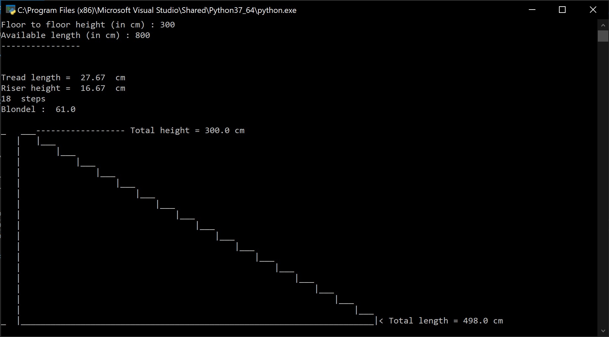

# Stair calculator
 ## Before starting
 
This is the first time I write Python code, so it might be bad. Indeed, for the sake of this assignment, I tried my best to translate some Visual Basic (Windows only) code I wrote during the first lockdown into Python (platform agnostic). Therefore, it may not be the most optimal code.

## Description
 

This program computes a straight stair based on the Blondel formula (2R + T = 61).

## Getting started

### Installing and Executing program

First, download the `Blondel_Calculator.py` file.

#### For Windows
* If you don't have it, [install python](https://www.microsoft.com/store/productId/9P7QFQMJRFP7)
* Right click on `Blondel_Calculator.py` and click "Open with > Python 3.9" *(I guess 3.7 is fine too)*

#### For macOS
* I don't have a Mac, but [this page](https://www.datacamp.com/community/tutorials/running-a-python-script) might help

### Data

Here are some inputs (in italic) you can try.

| Height (cm)   |  Width (cm)   |  Blondel formula  |  Tread (cm)  |  Riser (cm)  |
| :-----------: |:-------------:| :----------------:| :----------: | :----------: |
| *250*         | *370*         | 57,33             | 24           | 16,67        |
| *250*         | *450*         | 61                | 27,67        | 16,67        |
| *58*          | *100*         | 71,67             | 33           | 19,33        |

## Author

Sâm AFCHAR

## License

CC BY 4.0

## Acknowledgments

I made this program because I was tired of going to [Calculis · Escalier](https://calculis.net/escalier) for this basic task and wanted a local alternative.
